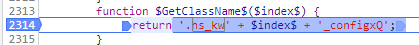
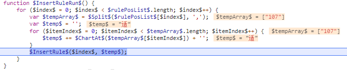

[目标网站]: https://car.autohome.com.cn/config/spec/716.html


##### F12打开chrome调试器, 发现该网站反爬虫


​	

##### 分析发现 

```css
<span class="hs_kw41_configOf"></span>
```

​	1. 该网站使用了css来反爬虫

​	2. class里面的值 “hs_kw41_configOf”是动态变化的

##### 分析css来源

1. 在chrome的network中搜索hs_kw 发现没有目标css文件
2. 说明代码是前端页面生成的
3. 继续搜索  hs_kw
4. 在716.html中发现了它

##### 分析html页面代码

1. 使用chrome格式化html

2. 确定了是用js生成的并 使用了混淆

3. 搜索 hs_kw

   

4. 发现这个函数就是class的值

5. 查看堆栈信息

6. 

7. 发现这里居然打印出了值


##### 删除多余代码

1. 一直删除多余代码 发现也能运行
2. 删除到最后
3. 
4. 发现是这个 (\(function\([a-zA-Z]{2}.*?_\).*?\(document\);)  正则表达式匹配的就是压缩加密代码
5. 最终有了该页面的最小执行代码

##### 构造JavaScript注入

1. 观察堆栈信息发现


2. 这里调用了这个函数

```javascript
$sheet$['insertRule']('.hs_kw2_configxQ::before { content:"车门数" }',2)
```

3. 搜索sheet发现

```javascript
var $sheet$ = $style$.sheet;
```

4. 搜索style

```javascript
var $style$ = mg_.createElement('style');
```

5. 搜索mg_

```javascript
(function(mg_) {}）(document);
```

6. 生产构造代码

```javascript
let rules = '';

document.createElement = function () {
	return {
		sheet: {
			insertRule: function (rule, i) {
				if (rules.length == 0) {
					rules = '#' + rule;
				} else {
					rules = rules + '#' + rule;
				}
			}
		}
	}
};
```

7. 合并后执行该文件发现运行出错


8. 继续构造

```javascript
document.head = {};
document.head.appendChild = function () {};
```

9. 发现没有报错了但没有输出值

   

10. 在chrome的console中输入rules


构造完整代码

```javascript
//首行添加

<script>
//保存 需要的值
let rules = '';

// 下面的代码缺少这个函数  同时这个函数也是最关键的注入函数
// $sheet$['' + BM_() + CS_() + Pl_() + gX_() + jC_()]($GetClassName$($index$) + $RuleCalss1$() + '"' + $item$ + '" }', 0); 这行翻译过来是  $sheet$['insertRule']( rule,0)
// 所以构造这个insertRule 方法  

// var $style$ = mg_.createElement('style');   //mg_ 就是document
// var $sheet$ = $style$.sheet;
// 所以是这么构造的
document.createElement = function () {
	return {
		sheet: {
			insertRule: function (rule, i) {
				if (rules.length == 0) {
					rules = '#' + rule;
				} else {
					rules = rules + '#' + rule;
				}
			}
		}
	}
};

//因为删除了其他的代码  在下面的js中就会缺少 document.head document.head.appendChild
//所以补上
document.head = {};
document.head.appendChild = function () {};

</script>

//末尾添加
document.write(rules)
```

